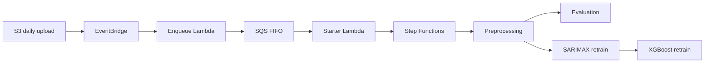

# Architecture

## Overview

TSF2 ingests daily retail data, aggregates it into biweekly periods, and runs a fixed pipeline: preprocess → evaluate current models → retrain SARIMAX and XGBoost models. Jobs are serialized so only one biweek executes at a time.

Evaluation and retraining run in parallel after preprocessing. SARIMAX retraining must succeed before XGBoost retraining starts.

## CDK stacks

| Stack | Resources |
|-------|-----------|
| **StorageStack** | S3 data and model buckets, DynamoDB job and model tables |
| **ComputeStack** | Preprocessing Lambda, ECS cluster, Fargate task definitions |
| **OrchestrationStack** | Step Functions state machine, FIFO job queue, orchestration lock table, enqueue/starter Lambdas, EventBridge rules |
| **MonitoringStack** | CloudWatch dashboard |

Environment is selected via CDK context: `-c env=dev` (default) or `-c env=prod`.

## Data flow

**Historical bootstrap** (local scripts, run once):

1. Upload raw CSVs to `raw/historical/`
2. Build SARIMAX prime/subprime processed data under `processed/`
3. Train and store initial SARIMAX and XGBoost models

**Live pipeline** (automated, biweekly):

1. Daily CSVs land at `raw/daily/YYYY/MM/DD/`
2. When all required datasets exist for every day in a biweek, the enqueue Lambda adds a job to the FIFO queue
3. The starter Lambda drains the queue one job at a time, using a DynamoDB lock to prevent concurrent executions
4. Step Functions runs preprocessing (subprime generation), then evaluation and retraining in parallel branches

Completion markers (`_COMPLETE` objects in S3) gate idempotency at each stage.

## Models

- **SARIMAX** — one model per product family and per store on biweekly aggregated series
- **XGBoost stacking regressor** — ensemble over SARIMAX predictions and engineered features

Model artifacts live in the model bucket; the model table tracks the current production pointer.

## Orchestration details

The FIFO queue plus DynamoDB lock ensure ordered, non-overlapping pipeline runs. The starter Lambda is invoked both when a job is enqueued and when Step Functions reaches a terminal state, so the queue drains automatically.

Stale locks (e.g. from a failed starter invocation) are recovered by checking whether the recorded Step Functions execution has finished.

## Local development

The **simulator** reads from a local copy of the Kaggle CSVs and uploads daily files to S3, exercising the same EventBridge → enqueue path as production without manual uploads.
